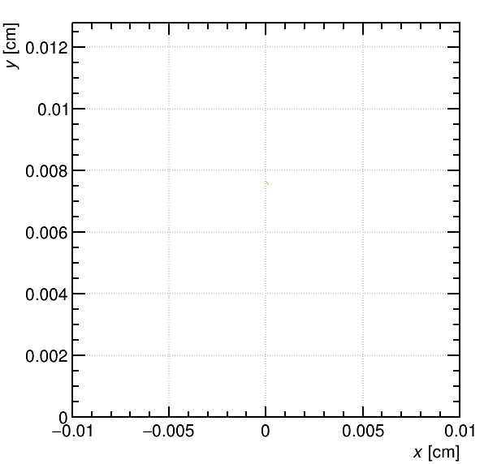
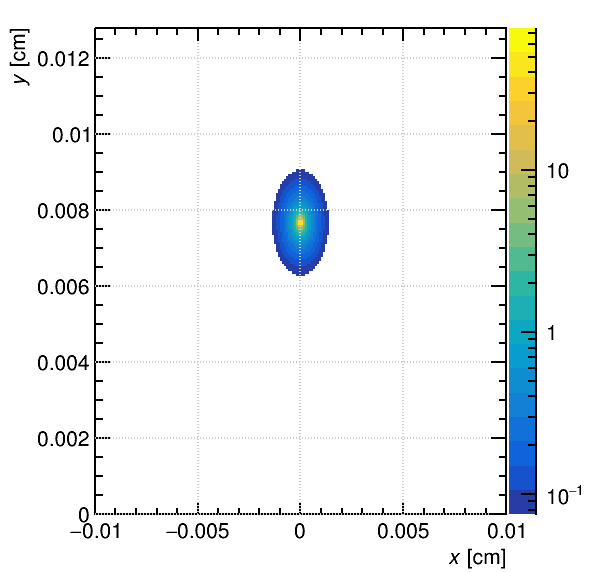
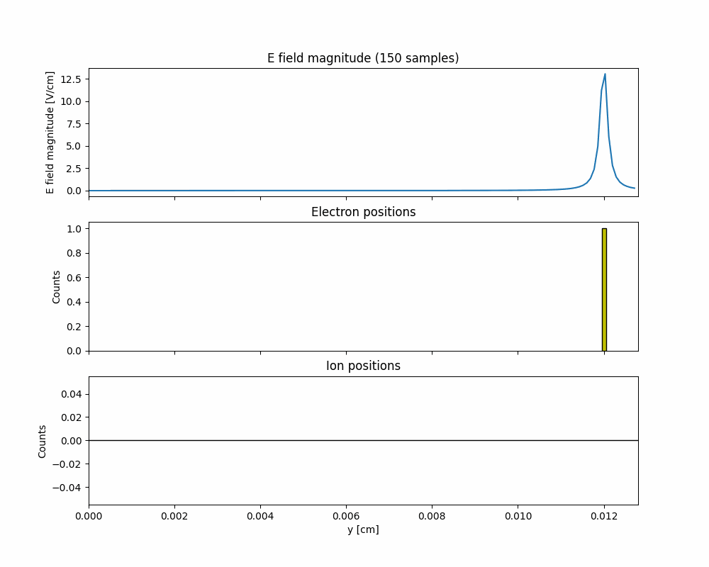

# spacecharge-sim
Simulation of the space-charge effect in Garfield++ 

- For use with GridBasedSpaceCharge branch of Garfield++, which can be found at https://gitlab.cern.ch/garfield/garfieldpp/-/tree/GridBasedSpaceCharge?ref_type=heads
- This repository does not include the relevant mesh/potential files (~150MB) which are necessary to run the code

